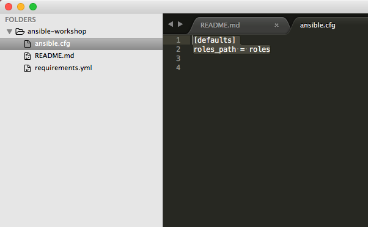
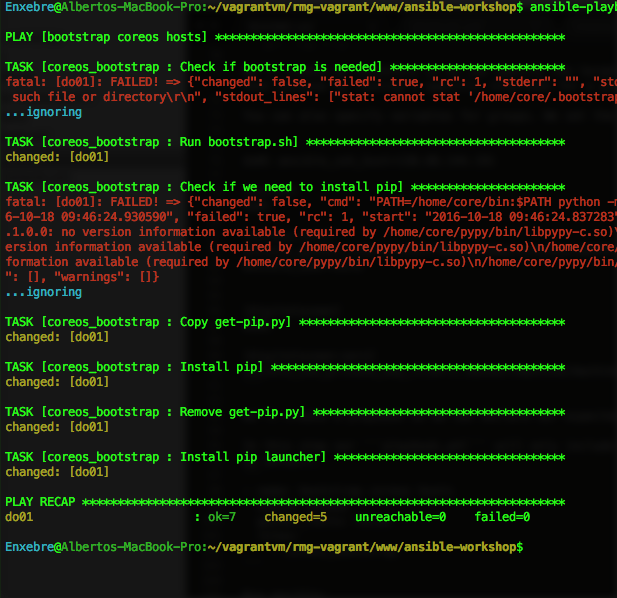
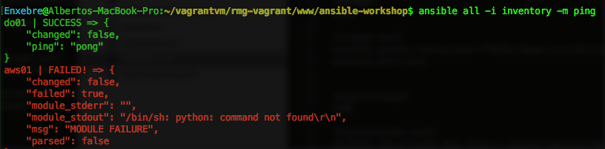
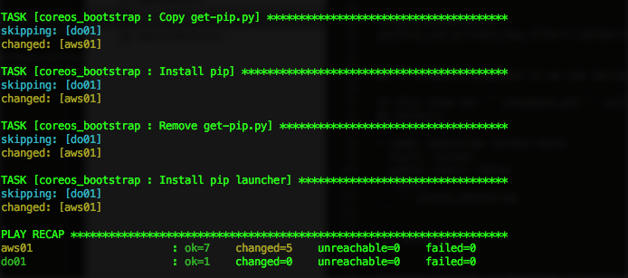
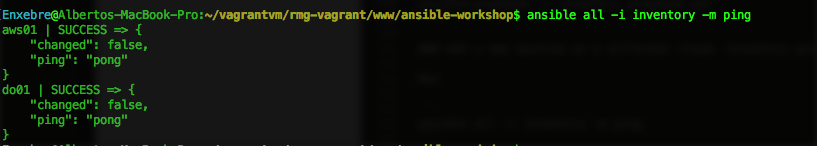
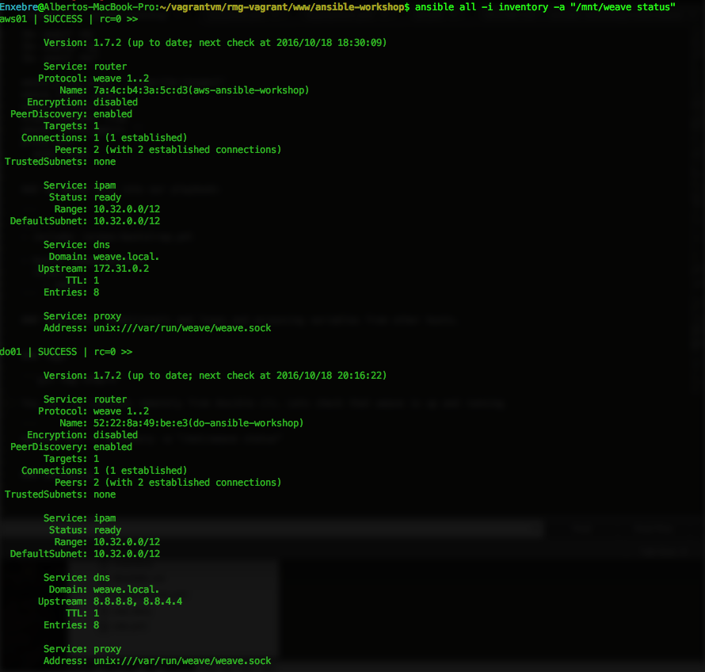
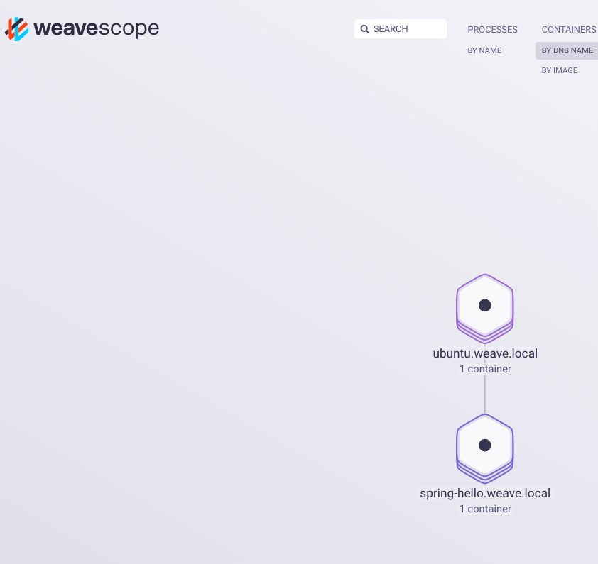

# Ansible workshop

This repo is a beginner guide to Ansible.

It will show you briefly the main concepts and its benefits by example.

The repo has several git tags starting with the simplest steps and will become a bit more sophisticated every tag.

At the end of this tutorial you'll have automated the set up of a cross-cloud software defined network for containers using Weave netm Weave Scope and Docker.

We'll deploy two containers one in DigitalOcean, another one in AWS that will communicate with each other.

This tutorial will assume that you have two machines running coreOS on DigitalOcean and AWS. You can create them manually or using something like terraform or docker-machine. We provide the docker-machine-bootstrap scrtip so you can use it and modify it for this purpose.

## Index

### [Theory](#theory-1)

What is it?

Inventory

Playbook - Roles, tasks and modules

Variables

Templates

Conditionals and loops

Debugging

Rolling upgrades


### Implementation

Download dependencies. Ansible galaxy.

Boostrap ansible dependencies for CoreOS. The Inventory and the Playbook.

Add a new machine on a different cloud. Inventory groups.

Satisfy your needs by overiding role variables.

Tags And conditionals


## Theory

### What is it?

https://www.ansible.com/quick-start-video

Ansible is a language to describe infrastructure expectations.

It's Human readable

Agent-less architecture just ssh + python interpreter

Automation engine that runs playbooks.


### Inventory

File where you declare the list of hosts that will match the expectations declared in a playbook.

You can specify meaninful groups of hosts in order to decide what systems you are controlling at what times and for what purpose.

You can specify group variables or host variables that will be available later in playbooks and [control how ansible interacts with remote hosts](http://docs.ansible.com/ansible/intro_inventory.html#list-of-behavioral-inventory-parameters.

http://docs.ansible.com/ansible/intro_inventory.html

http://docs.ansible.com/ansible/intro_dynamic_inventory.html

http://docs.ansible.com/ansible/intro_patterns.html


### Playbook - Roles, tasks and modules

A playbook is a yml file where you describe the desired state of a host or a group of hosts declared in the inventory.

Ansible ships with a [list of modules](http://docs.ansible.com/ansible/list_of_all_modules.html)

You can create a task using the module that satisfy you necessity.

You can encapsulate a group of meaningfully related tasks in a role.

You can apply roles to hosts in the playbook.

Playbook -> role -> task -> module


### Variables

Ansible provides a mechanisim for overriding variables.

You [can go deeply](http://docs.ansible.com/ansible/playbooks_variables.html) on this but a useful guideline to begging with is:

cli extra-vars -> host_vars/hostname.yml -> group_vars/group_name.yml -> group_vars/all.yml -> role defaults


### Templates

[Templates](http://docs.ansible.com/ansible/template_module.html) are a powerful resource for generating files or scripts on the hosts

A template will have a common structure and it will be populated with specify values at runtime.


### Conditionals and loops

You can run roles or tasks depending on a conditional statement.

```
tasks:
  - name: "shut down Debian flavored systems"
    command: /sbin/shutdown -t now
    when: ansible_os_family == "Debian"
    # note that Ansible facts and vars like ansible_os_family can be used
    # directly in conditionals without double curly braces
```

http://docs.ansible.com/ansible/playbooks_conditionals.html#loops-and-conditionals


### Rolling upgrades

[You can run ansible in serial and have control on how many servers you want to run it at one time.](http://docs.ansible.com/ansible/guide_rolling_upgrade.html)


### Debugging

```ansible all -i inventory -m setup```

```ansible all -i inventory -m ping```

```ansible all -i inventory -a ls```

```ansible-playbook --list-host -i inventory playbook.yml```

In your playbook:

```
 - hosts: all
   tasks:
   - name: Display all variables/facts known for a host
     debug: var=hostvars
```


## Implementation steps

### Download dependencies. Ansible galaxy.

```git tag step-1```

Before reinventing the wheel you can try yo reuse.
[Ansible galaxy](https://galaxy.ansible.com/) is a website for sharing and downloading Ansible roles and a command line tool for managing and creating roles. You can download roles from Ansible galaxy or from your specific git repository.
Ansible allows you to define your dependencies with standalone roles in a yaml file. See ```requirements.yml```

```
- src: defunctzombie.coreos-bootstrap
  name: coreos_bootstrap
```

We'll use CoreOS machines in this tutorial. By default Ansible assumes it can find a /usr/bin/python on your remote system. Coreos machines are minimal and do not ship with any version of python. The [coreos-bootstrap role](https://github.com/defunctzombie/ansible-coreos-bootstrap) will install [pypy](http://pypy.org/) for us.

Certain settings in Ansible are adjustable via a [configuration file](http://docs.ansible.com/ansible/intro_configuration.html). [Click here for very complete template](https://github.com/ansible/ansible/blob/devel/examples/ansible.cfg).

We'll set here the target folder for our community roles

In ```ansible.cfg``` you can see:

```
[defaults]
roles_path = roles
```



Just run ```ansible-galaxy install -r requirements.yml```

### Boostrap ansible dependencies for CoreOS. The Inventory and the Playbook.

```git tag step-2```

We'll create an inventory so we can specify the target hosts. You can create meaninful groups for your hosts in order to decide what systems you are controlling at what times and for what purpose.

You can also specify variables for groups. We set the CoreOS specifics here.

```
do01 ansible_ssh_host=138.68.144.191

[coreos]
do01

[coreos:vars]
ansible_python_interpreter="PATH=/home/core/bin:$PATH python"
ansible_user=core


[digitalocean]
do01

[digitalocean:vars]
ansible_ssh_private_key_file=~/.docker/machine/machines/do-ansible-workshop/id_rsa
```

We'll create a playbook so we can declare our expected configuration for every host.

In this step our ```playbook.yml``` will only include the role downloaded previewsly on every coreos machine (just one so far).
By default.
```
- name: bootstrap coreos hosts
  hosts: coreos
  gather_facts: False
  roles:
    - coreos_bootstrap
```

Run ansible:

```
ansible-playbook -i inventory playbook.yml
```



### Add a new machine on a different cloud. Inventory groups.

```git tag step-3```

Run:

```
ansible all -i inventory -m ping
```

You will see it fail for aws01 as the python interpreter is not there yet.



So let's apply the playbook again.

```
ansible-playbook -i inventory playbook.yml
```



Now:

```
ansible all -i inventory -m ping
```



Nice!

### Overriding role variables.

```git tag step-4```

So far we have used Ansible to set up a python interpreter for the CoreOS machines so we can run Ansible effectively as many modules rely on python.

In this Step we'll setup a [Weave network](https://www.weave.works/products/weave-net/) and [Weave Scope](https://www.weave.works/products/weave-scope/) between both clouds so docker containers can communicate with ease.

We add a new role dependency on the requirements.

```
- src: defunctzombie.coreos-bootstrap
  name: coreos_bootstrap

- src: https://github.com/Capgemini/weave-ansible
  name: weave
``` 

Run:

```
ansible-galaxy install -r requirements.yml
```

We'll modify the inventory to create a group of hosts that belong to the weave network. By using the ["children"](http://docs.ansible.com/ansible/intro_inventory.html#groups-of-groups-and-group-variables) tag you can create a group of groups

```
[weave_servers:children]
digitalocean
aws
```

We'll override the weave role variables for satisfying our needs. Ansible allows to create variables per host, per group, or site wide variables by setting ```group_vars/all```

In ```group_vars/weave_server.yml```

```
weave_launch_peers: "


{{ hostvars[host].ansible_ssh_host }}

"

weave_proxy_args: '--rewrite-inspect'
weave_router_args: ''
weave_version: 1.7.2
scope_enabled: true
scope_launch_peers: ''
proxy_env: 
  none: none
```

Add te weave role into our playbook:

```
---
- include: coreos-bootstrap.yml

- hosts: weave_servers
  roles:
    - weave
```

You can run commands remotely from Ansible cli. Lets check that weave is up and running:

```
ansible all -i inventory -a "/mnt/weave status"
```



We should be able to access to the Scope UI on the browser now:


### Templates and accessing variables from other hosts.

The weave role relies on Ansible templates for generating Systemd scripts:

weave.service.j2:

```
[Unit]
After=docker.service
Description=Weave Network Router
Documentation=http://docs.weave.works/
Requires=docker.service

[Service]
TimeoutStartSec=0
EnvironmentFile=-/etc/weave.%H.env
EnvironmentFile=-/etc/weave.env
Environment=WEAVE_VERSION={{ weave_version }}

ExecStartPre={{ weave_bin }} launch-router $WEAVE_ROUTER_ARGS $WEAVE_PEERS
ExecStart=/usr/bin/docker attach weave
ExecStartPost={{ weave_bin }} expose
Restart=on-failure

ExecStop={{ weave_bin }} stop-router

[Install]
WantedBy=multi-user.target
```

weave.env.j2:

```
WEAVE_PEERS="{{ weave_launch_peers }}"
WEAVEPROXY_ARGS="{{ weave_proxy_args }}"
WEAVE_ROUTER_ARGS="{{ weave_router_args }}"
# Uncomment and make it more secure
# WEAVE_PASSWORD="aVeryLongString"
```

Weave needs to know the ips of the different host of the network.
[Ansible provide some magic variables so you can get information from the different hosts while running a playbook](http://docs.ansible.com/ansible/playbooks_variables.html#magic-variables-and-how-to-access-information-about-other-hosts).

This templates are populated at runtime by using ```hostvars``` magic variable.

```
weave_launch_peers: "


{{ hostvars[host].ansible_ssh_host }}

"
```


### Tags And conditionals

```git tag step-5```

In this step we'll use the power of [tags](http://docs.ansible.com/ansible/playbooks_tags.html) and conditional in order to deploy some services running on docker so we can test that they can communicate from DigitalOcean to AWS.

The playbook will look like this now:

```
---
- include: coreos-bootstrap.yml

- hosts: weave_servers
  roles:
    - weave

- include: deployment.yml
  when: deployment_enabled
  tags:
  - deployment

```

We'll run this under demand by using the conditional ```when: deployment_enabled``` and tags.

We'll create a site wide variables file at ```group_vars/all.yml```

```
deployment_enabled: true
```

Run only the deployment tasks by specifying the tag:

```
ansible-playbook -i inventory playbook.yml --tags="deployment"
```

```weaveworks/gs-spring-boot-docker``` is running on AWS now and ```weaveworks/weave-gs-ubuntu-curl``` is running on DigitalOcean.

If you check the logs for the ```weaveworks/weave-gs-ubuntu-curl``` container or you run ```curl http://spring-hello.weave.local:8080/``` inside the container you'll see how is communicating with the ```weaveworks/gs-spring-boot-docker``` container that is running on AWS.

You can also check the connection on Scope:





