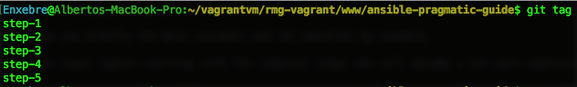

- This is a **beginner guide to Ansible.**

- It will show you briefly the main concepts and its benefits by example.

- The repo has git tags matching the different steps for a use case.

- At the end of this tutorial you'll have automated the set up of a cross-cloud software defined network for containers on [CoreOS](https://coreos.com) using [Weave net](https://www.weave.works/products/weave-net/), [Weave Scope](https://www.weave.works/products/weave-scope/) and [Docker](https://www.docker.com/).

- We'll deploy two containers one in **DigitalOcean**, another one in **AWS** that will communicate with each other.

To follow the use case you'll need to:

```
git clone git@github.com:enxebre/ansible-pragmatic-guide.git
```

The use case will guide you through the different steps by using git tags:


