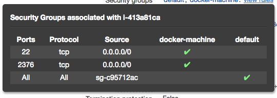

This tutorial is using **ansible 2.0.2.0**

The source code is here ```git clone git@github.com:enxebre/ansible-pragmatic-guide.git```

This tutorial will assume that you have two machines running coreOS on DigitalOcean and AWS. You can create them manually or using something like [Terraform](https://www.terraform.io/) or [docker-machine](https://docs.docker.com/machine/get-started/). We provide the [docker-machine-bootstrap](https://github.com/enxebre/ansible-pragmatic-guide/blob/master/docker-machine-bootstrap) script so you can use it and modify it for this purpose.

```bash
# AWS
# --amazonec2-access-key AKI******* \
# --amazonec2-secret-key 8T93C******* \
docker-machine create --driver amazonec2 \
--amazonec2-region "eu-west-1" \
--amazonec2-ssh-user core \
--amazonec2-device-name /dev/xvda \
--amazonec2-ami ami-e3d6ab90 \
aws-ansible-workshop

# DigitalOcean
export DOTOKEN=${DOTOKEN}
docker-machine create --driver digitalocean \
--digitalocean-access-token $DOTOKEN \
--digitalocean-region lon1 \
--digitalocean-image coreos-stable \
--digitalocean-ssh-user core \
do-ansible-workshop
```

We'll use the public ips of these machines to create the weave network. Make sure your aws security groups configuration match the Weave requirements.
For this demo I used a totally open configuration.



If you don't want to create these machines you could use any machine with docker and [systemd](https://www.freedesktop.org/wiki/Software/systemd/) reachable via ssh from where you are running Ansible. 