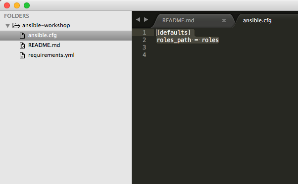
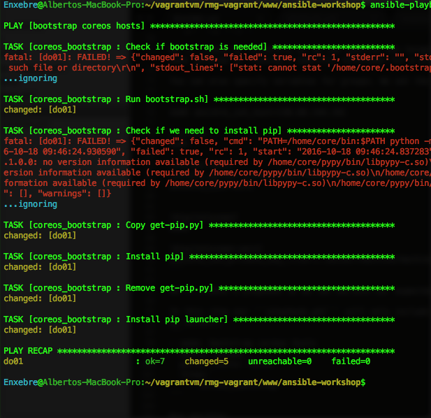
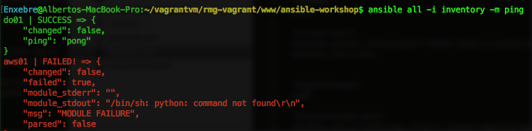
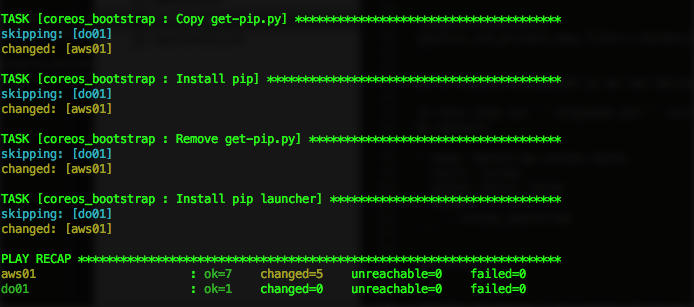
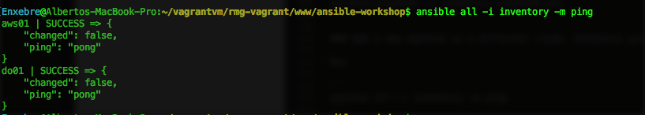
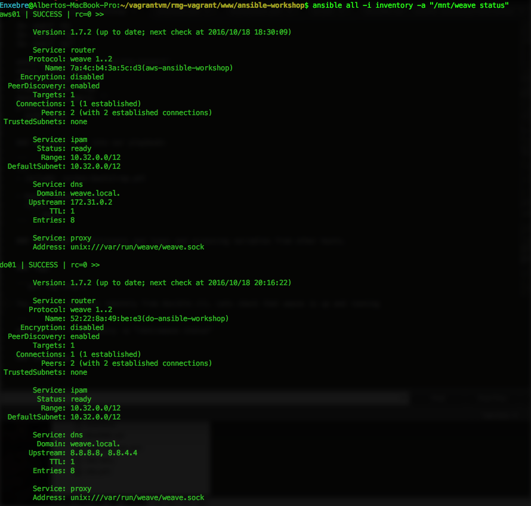
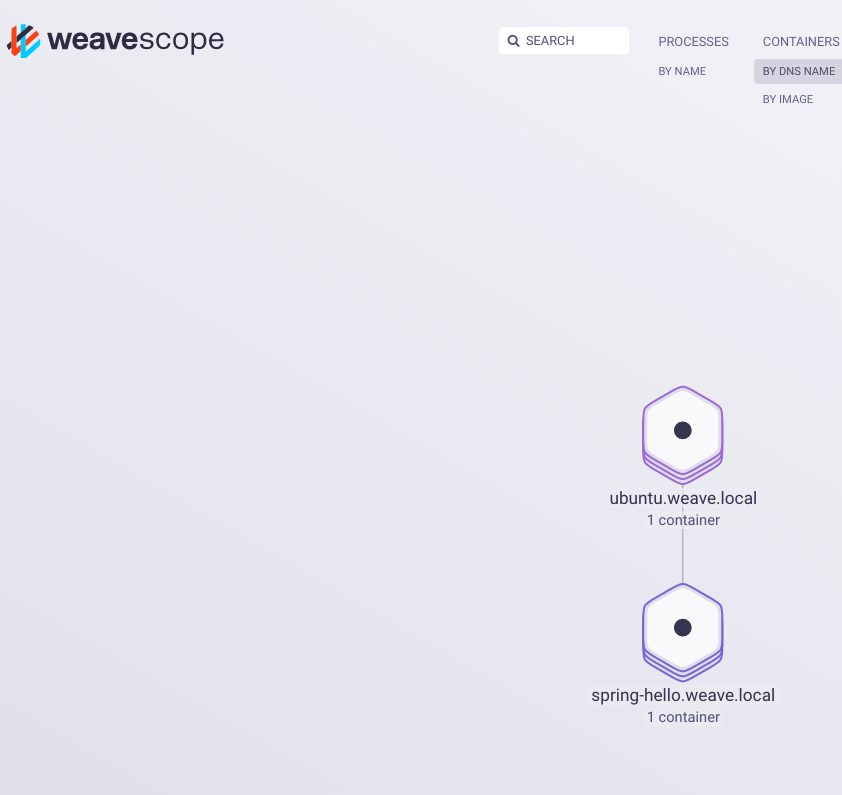
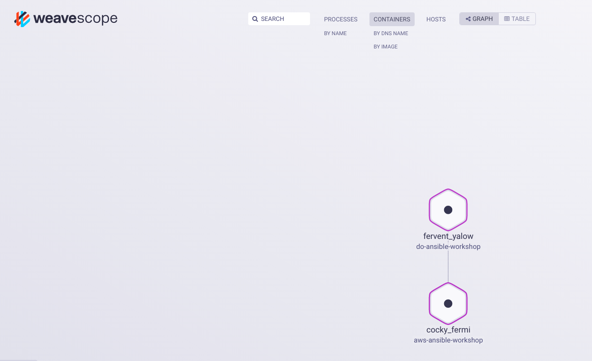
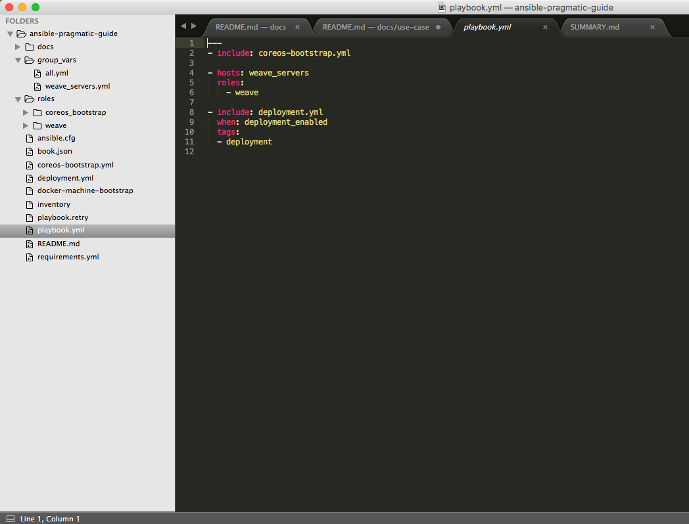

# Overview

This use case will guide you on how to set up of a cross-cloud software defined network for containers using [Weave net](https://www.weave.works/products/weave-net/), [Weave Scope](https://www.weave.works/products/weave-scope/) and [Docker](https://www.docker.com/).

See [requirements](../REQUIREMENTS.md).

At the end we'll deploy two containers one in DigitalOcean and another one in AWS that will communicate with each other.

As we'll use CoreOS that are minimal and do not ship with any version of python we'll need to install a python interpreter inside the machines. We'll use an Ansible community module for this, let's begin...

# Downloading dependencies. Ansible galaxy.

**Source code:** ```git tag step-1```

Before reinventing the wheel you can try yo reuse.
[Ansible galaxy](https://galaxy.ansible.com/) is a website for sharing and downloading Ansible roles and a command line tool for managing and creating roles. You can download roles from Ansible galaxy or from your specific git repository.
Ansible allows you to define your dependencies with standalone roles in a yaml file. See ```requirements.yml```

```
- src: defunctzombie.coreos-bootstrap
  name: coreos_bootstrap
```

We'll use CoreOS machines in this tutorial. By default Ansible assumes it can find a /usr/bin/python on your remote system. Coreos machines are minimal and do not ship with any version of python. The [coreos-bootstrap role](https://github.com/defunctzombie/ansible-coreos-bootstrap) will install [pypy](http://pypy.org/) for us.

Certain settings in Ansible are adjustable via a [configuration file](http://docs.ansible.com/ansible/intro_configuration.html). [Click here for a very complete template](https://github.com/ansible/ansible/blob/devel/examples/ansible.cfg).

We'll set here the target folder for our community roles

In ```ansible.cfg```:

```
[defaults]
roles_path = roles
```



Just run ```ansible-galaxy install -r requirements.yml```

# Boostraping ansible dependencies for CoreOS. The Inventory and the Playbook.

**Source code:** ```git tag step-2```

We'll create an inventory so we can specify the target hosts. You can create meaninful groups for your hosts in order to decide what systems you are controlling at what times and for what purpose.

You can also specify variables for groups. We set the CoreOS specifics here.

```
do01 ansible_ssh_host=138.68.144.191

[coreos]
do01

[coreos:vars]
ansible_python_interpreter="PATH=/home/core/bin:$PATH python"
ansible_user=core


[digitalocean]
do01

[digitalocean:vars]
ansible_ssh_private_key_file=~/.docker/machine/machines/do-ansible-workshop/id_rsa
```

We'll create a playbook so we can declare our expected configuration for every host.

In this step our ```playbook.yml``` will only include the role downloaded previewsly on every coreos machine (just one so far).
By default.

```yml
- name: bootstrap coreos hosts
  hosts: coreos
  gather_facts: False
  roles:
    - coreos_bootstrap
```

Run ansible:

```
ansible-playbook -i inventory playbook.yml
```



# Adding a new machine on a different cloud. Inventory groups.

**Source code:** ```git tag step-3```

We add the new machine into our Inventory file:

```
do01 ansible_ssh_host=46.101.87.119
aws01 ansible_ssh_host=52.49.153.19

[coreos]
do01
aws01

[coreos:vars]
ansible_python_interpreter="PATH=/home/core/bin:$PATH python"
ansible_user=core


[digitalocean]
do01

[digitalocean:vars]
ansible_ssh_private_key_file=~/.docker/machine/machines/do-ansible-workshop/id_rsa

[aws]
aws01

[aws:vars]
ansible_ssh_private_key_file=~/.docker/machine/machines/aws-ansible-workshop/id_rsa
```

Run:

```
ansible all -i inventory -m ping
```

You will see it fails for aws01 as the python interpreter is not there yet.



So let's apply the playbook again.

```
ansible-playbook -i inventory playbook.yml
```



Now:

```
ansible all -i inventory -m ping
```



Nice!

# Overriding role variables.

**Source code:** ```git tag step-4```

So far we have used Ansible to set up a python interpreter for the CoreOS machines so we can run Ansible effectively as many modules rely on python.

In this Step we'll setup a [Weave network](https://www.weave.works/products/weave-net/) and [Weave Scope](https://www.weave.works/products/weave-scope/) between both clouds so docker containers can communicate with ease.

We add a new role dependency on the requirements.

```yml
- src: defunctzombie.coreos-bootstrap
  name: coreos_bootstrap

- src: https://github.com/Capgemini/weave-ansible
  name: weave
``` 

Run:

```
ansible-galaxy install -r requirements.yml
```

We'll modify the inventory to create a group of hosts that belong to the weave network. By using the ["children"](http://docs.ansible.com/ansible/intro_inventory.html#groups-of-groups-and-group-variables) tag you can create a group of groups

```
[weave_servers:children]
digitalocean
aws
```

We'll override the weave role variables for satisfying our needs. Ansible allows to create variables per host, per group, or site wide variables by setting ```group_vars/all```

In ```group_vars/weave_server.yml```

```yml
weave_launch_peers: "


{{ hostvars[host].ansible_ssh_host }}

"

weave_proxy_args: '--rewrite-inspect'
weave_router_args: ''
weave_version: 1.7.2
scope_enabled: true
scope_launch_peers: ''
proxy_env: 
  none: none
```

Add te weave role into our playbook:

```yml
---
- include: coreos-bootstrap.yml

- hosts: weave_servers
  roles:
    - weave
```

You can run commands remotely from Ansible cli. Lets check that weave is up and running:

```
ansible all -i inventory -a "/mnt/weave status"
```



We should be able to access to the Scope UI on the browser now:


# Templates and variables from other hosts.

The weave role relies on Ansible templates for generating Systemd scripts:

weave.service.j2:

```
[Unit]
After=docker.service
Description=Weave Network Router
Documentation=http://docs.weave.works/
Requires=docker.service

[Service]
TimeoutStartSec=0
EnvironmentFile=-/etc/weave.%H.env
EnvironmentFile=-/etc/weave.env
Environment=WEAVE_VERSION={{ weave_version }}

ExecStartPre={{ weave_bin }} launch-router $WEAVE_ROUTER_ARGS $WEAVE_PEERS
ExecStart=/usr/bin/docker attach weave
ExecStartPost={{ weave_bin }} expose
Restart=on-failure

ExecStop={{ weave_bin }} stop-router

[Install]
WantedBy=multi-user.target
```

weave.env.j2:

```
WEAVE_PEERS="{{ weave_launch_peers }}"
WEAVEPROXY_ARGS="{{ weave_proxy_args }}"
WEAVE_ROUTER_ARGS="{{ weave_router_args }}"
# Uncomment and make it more secure
# WEAVE_PASSWORD="aVeryLongString"
```

Weave needs to know the ips of the different host of the network.
[Ansible provide some magic variables so you can get information from the different hosts while running a playbook](http://docs.ansible.com/ansible/playbooks_variables.html#magic-variables-and-how-to-access-information-about-other-hosts).

This templates are populated at runtime by using ```hostvars``` magic variable.

```yml
weave_launch_peers: "


{{ hostvars[host].ansible_ssh_host }}

"
```


# Tags And conditionals

**Source code:** ```git tag step-5```

In this step we'll use the power of [tags](http://docs.ansible.com/ansible/playbooks_tags.html) and conditional in order to deploy some services running on docker so we can test that they can communicate from DigitalOcean to AWS.

The playbook will look like this now:

```
---
- include: coreos-bootstrap.yml

- hosts: weave_servers
  roles:
    - weave

- include: deployment.yml
  when: deployment_enabled
  tags:
  - deployment

```

We'll run this under demand by using the conditional ```when: deployment_enabled``` and tags.

We'll create a site wide variables file at ```group_vars/all.yml```

```
deployment_enabled: true
```

Run only the deployment tasks by specifying the tag:

```
ansible-playbook -i inventory playbook.yml --tags="deployment"
```

```weaveworks/gs-spring-boot-docker``` is running on AWS now and ```weaveworks/weave-gs-ubuntu-curl``` is running on DigitalOcean.

If you check the logs for the ```weaveworks/weave-gs-ubuntu-curl``` container or you run ```curl http://spring-hello.weave.local:8080/``` inside the container you'll see how is communicating with the ```weaveworks/gs-spring-boot-docker``` container that is running on AWS.

You can also check the connection on Scope:






# Summary

After following all the steps the folder tree will look like this:



You should have now be able to understand the strengths of Ansible and how to make the most out of it.
